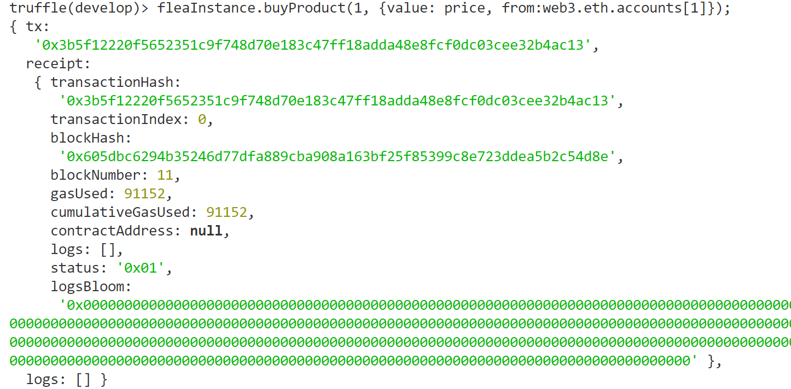

# Flea Market . Development Report

- [二手市场_以太坊Dapp](#FleaMarketDevelopmentReport)
    - [一、选题背景](#一选题背景)
    - [二、初始化项目环境](#二初始化项目环境)
        - [1. truffle框架介绍及安装](#1-truffle框架介绍及安装)
        - [2. 创建项目目录](#2-创建项目目录)
    - [三、编写智能合约](#三编写智能合约)
        - [1. 定义结构体 & 状态变量](#1-定义结构体--状态变量)
        - [2. 发布商品 addProduct()](#2-发布商品-addproduct)
        - [3. 购买商品 buyProduct()](#3-购买商品-buyproduct)
        - [4. 帮助方法](#4-帮助方法)
    - [四、部署智能合约](#四部署智能合约)
    - [五、测试合约](#五测试合约)
    - [六、Web前端开发](#六Web前端开发)
      - [1. 商品展示](#1-商品展示)
      - [2. 发布商品](#2-发布商品)
      - [3. 购买商品](#3-购买商品)
    - [七、Flea Market的使用](#七Flea-Market的使用)
      - [1. 启动服务](#1-启动服务)
      - [2. 安装及使用MeatMask](#2-安装及使用MeatMask)
      - [3. 发布商品](#3-发布商品)
      - [4. 购买商品](#4-购买商品)

## 一、选题背景
DApp，即是去中心化应用Decentralized Application。去中心化应用拥有几个主要特点： 
1. 应用数据分布式地存储在区块链的所有节点中； 
2. 由于区块链的特性，应用数据公开透明，且不可篡改，安全性高； 
3. 应用的逻辑完全由智能合约实现，应用所有规则都是完全透明的，任何人都无权更改规则。


由于这些特性的存在，DApp可以说是一个存储和管理数据的更可靠和安全的系统。然而，目前很多区 块链项目都很难落地，许多DApp都只是浅尝辄止，能火起来的DApp屈指可数。比如，CryptoKitties是 一款以太坊区块链的虚拟养猫游戏，上线数天就一跃成为以太坊交易量最高的DApp，甚至一度造成以 太坊拥堵。或许是去中心化的特性在游戏领域上展现出了突出的优势，受到了玩家的追捧。当然， DApp绝对不止是能在游戏领域发光发热，像是涉及交易的商城应用也具有一定的潜力。今年4月份上 线的星球商城DApp结合了传统的电商模式以及区块链的激励机制，无论对商家还是用户都具有一定的 吸引力，短短一个月就拥有了20万用户，被评论为2018为数不多的落地项目。通过实现一个能够进行 交易的DApp或许是一个不错的学习方法。  

本次期末项目将尝试实现一个能够进行二手商品交易的DApp - FleaMarket，体验交易领域中DApp的优点。整个项目将会涉及到较多知识点，包括创建Truffle项目、编写智能合约、部署合约到区块链、熟悉使用web3.js和智能合约交互、web前端开发、使用MetaMask访问以太坊网络以及管理钱包等知识。  

FleaMarket主要有两大功能，分别是 发布二手商品 以及 购买已上架的二手商品。用户能够填写自己想要售出的商品信息，并发布到以太坊网络上。并且用户也能够浏览所有已经上架的商品，并可以选择购买心仪的商品，通过使用MetaMask扩展程序进行支付，将相应的金额转到卖家的地址，完成交易。

> **选题更改说明**：原本的项目打算实现一个拍卖市场 AuctionStore ，包括拍卖商品上架、拍卖商品展示、商品拍卖功能。可是在编写完智能合约、实现用户交互的过程中，发现在所有人都投标后，总要有一个人调用合约中结束拍卖的方法，不然无法完成交易。完成交易就需要更改区块链上的信息，这个操作是要消耗gas的，理想的执行人选自然就是卖家，但是万一卖家跑路了不结束拍卖怎么办？投标者的钱就回不来了。想了很久之后总觉得这样可以托管金钱的应用不太安全，就改为了现在的二手市场，将拍卖商品功能更改为商品交易功能，买家和卖家之间直接转账，就不用担心跑路了。

## 二、初始化项目环境  

本项目基于Windows10系统开发

### 1. truffle框架介绍及安装  
Truffle是一个DApp开发框架，在一定程度上简化了建构和管理项目的麻烦。简单来说，它一个帮助书写编译和发布基于Solidity的智能合约的工具。Truffle具有以下优点：

 - 首先对客户端做了深度集成。开发，测试，部署一行命令都可以搞定。不用再记那么多环境地址，繁重的配置更改，及记住诸多的命令。
 - 它提供了一套类似`maven`或`gradle`这样的项目构建机制，能自动生成相关目录，默认是基于Web的。
 - 提供了合约抽象接口，可以直接通过`var meta = MetaCoin.deployed();`拿到合约对象后，在Javascript中直接操作对应的合约函数。原理是使用了基于`web3.js`封装的`Ether Pudding`工具包。简化开发流程。
 - 提供了控制台，使用框架构建后，可以直接在命令行调用输出结果，可极大方便开发调试。
 - 提供了监控合约，配置变化的自动发布，部署流程。不用每个修改后都重走整个流程。


**NodeJS**  
首先，Truffle需要依赖NodeJS。Windows用户如果没安装的话可以访问[NodeJS官网](https://nodejs.org/en/)下载。安装成功后在命令行输入`node -v`和`npm -v`检查是否安装成功。

**Truffle**  
以管理员身份打开powershell，输入`npm install -g truffle`安装truffle（图中为VSCode的命令行）。  


> 如果你是Windows用户，那就需要注意：Windows 系统有个命名问题，它会让我们在执行 Truffle 命令的时候只打开配置文件"truffle.js"，而不会读取里面的内容。解决方法是。修改Windows的PATHEXT环境变量，去掉.js后缀，避免以后在Truffle目录下运行"truffle"命令可能遇到的麻烦。

### 2. **创建项目目录**  
truffle提供了很多项目模板，即是[truffle box](https://truffleframework.com/boxes)，可以快速搭建一个去中心化应用的代码骨架。简单来说，`truffle box`是将solidity智能合约、相关库、前端框架都集成在一起的集合，方便开发人员在最大程度上简化不必要的环境搭建和技术选型工作。 

创建一个项目目录，然后进行初始化。先利用`truffle box`的`webpack`模板来配置拍卖市场。  
```
$ mkdir auctionDapp
$ cd auctionDapp
$ truffle unbox webpack
```

可是在配置的过程中发生了错误，在Stackoverflow上找到了同样问题以及解决方案：[Error in unboxing truffle-react on Windows](https://ethereum.stackexchange.com/questions/47937/error-in-unboxing-truffle-react-on-windows)  

输入以下两条命令后，耐心等待即可。  
```
npm install --global--production windows-build-tools  
npm install --global node-gyp
```  
  
这次再重建项目目录，就没问题了。  
  
```
|--app          // 前端设计，包括html,css,js
|--build        // 智能合约编译后文件存储路径
|--contracts    // 智能合约文件存储路径
|--migrations   // 存放发布脚本文件
|--node_modules // 相关nodejs库文件
|--test         // 合约测试文件存放路径
|--box-img-lg.png
|--box-img-sm.png
|--LICENSE
|--package-lock.json
|--package.json
|--truffle.js
|--webpack.config.js
```
删掉contracts目录下用于测试的ConvertLib.sol,MetaCoin.sol，避免干扰。

---

## 二、编写智能合约   

整个商品交易的步骤可以分为：

 - 卖家发布商品，提供商品名字、发售价格、商品类别、商品描述；
 - 每一个发布的商品（无论是否已售出）都会在FleaMarket上列出，用户可以查看所有的商品信息；
 - 对于未售出的商品，用户可以购买，通过向卖家支付该商品的售价，完成交易；

> 使用的solidity版本为：solidity ^0.4.17;

#### 1. 定义结构体 & 状态变量  
首先定义最主要的商品信息结构体Product。这个结构体用于存储所有于其相关的信息，包括它的商品id、名字、商品分类、出售状态、商品价格、商品描述等，具体可看下面代码。  

Product结构体中有一个变量`Status`，表示商品状态，通过枚举型定义，商品状态共有2个，分别是`AVAILABLE` - 商品可购买，`SOLD` - 商品已售出。在Solidity中，当enum类型的枚举数不够多时，它默认的类型为uint8，即是说这两个状态其实是uint8类型的0、1。  

除了结构体，还需要用到几个状态变量。状态变量是被永久地保存在合约中。也就是说它们被写入以太币区块链中. 想象成写入一个数据库。

 - productCount， uint类型，统计商品的数量
 - productSaler， 一个映射，从 商品id 映射到 卖家地址
 - store，        一个映射，从 商品id 映射到 商品对象

``` c
    // 商品状态 - 用于描述商品信息
    enum Status {
        AVAILABLE,  // 可购买
        SOLD        // 已售出
    }

    // 商品信息
    struct Product{
        uint id;                    // 商品ID

        string name;                // 商品名字
        string classification;      // 商品分类
        Status status;              // 商品状态
        uint price;                 // 商品价格
        string description;         // 商品描述
        // string imageHash;        // 商品图片哈希

        address buyer;              // 购买者地址
        uint buyPrice;              // 购买者出价
    }

    uint productCount;                      // 统计商品的数量
    mapping(uint => address) productSaler;  // 商品id -> 卖家地址
    mapping(uint => Product) store;         // 商品id -> 商品对象

    // 构造函数
    constructor() public {
        productCount = 0;
    }
```

#### 2. 发布商品 addProduct()  

> **msg.sender：** 在 Solidity 中，有一些全局变量可以被所有函数调用。 其中一个就是 msg.sender，它指的是当前调用者（或智能合约）的address，可以在调用函数时通过from参数传入。  
**storage & memory：** 在 Solidity 中，有两个地方可以存储变量 。`Storage` 变量是指永久存储在区块链中的变量，使用storage(存储)是相当昂贵的，“写入”操作尤其贵，随着区块链的增长，拷贝份数更多，存储量也就越大。 `Memory` 变量则是临时的，当外部函数对某合约调用完成时，内存型变量即被移除，可以节省很多gas。

我们可以以不同的msg.sender身份来发布商品。发布商品时，要提供相应的商品信息。然后更新商品数量productCount，使用productCount作为新商品的id，并更新store和productSaler映射。


``` c
    // 发布商品，返回发布id
    function addProduct(string _name, string _class, uint _price, string _description) public returns(uint){
        // require(users[msg.sender] > 0, "您尚未注册");
        // require(keccak256(bytes(_password)) == users[msg.sender], "密码不正确");        
        productCount++;       
        Product memory product = 
            Product(productCount, _name, _class, Status.AVAILABLE, _price, _description, 0, 0);       
        store[productCount] = product;
        productSaler[productCount] = msg.sender;
        return productCount;
    }
```

> 后续补充：非view函数的返回值是一个Object，交互并不方便，建议还是使用view类型的函数返回productCount

#### 3. 购买商品 buyProduct()  
当商品发布后，用户可以通过指定商品id来购买商品，购买需要支付与售价同样的以太币。购买成功后，更新商品的买家地址、买家付款金额 以及 商品状态。如果买家支付的金额大于售价，则将与售价相同的以太币转给卖家，多余的返还给买家。不过出价>售价的情况可以通过后续的js代码规避，只让买家支付与售价等额的以太币即可。


> **payable 修饰符：** 它是一种可以接收以太的特殊函数。如果一个函数没标记为payable， 而你尝试利用上面的方法发送以太，函数将拒绝你的事务。
**msg.value：** 合约调用方附带的以太币，在这里就是投标者的出资。
 
``` c
    // 购买商品，完成交易，更改商品信息
    function buyProduct(uint _productID) public payable returns(bool) {       
        Product storage product = store[_productID];
        require(msg.value >= product.price, "付款金额不足");

        product.buyer = msg.sender;
        product.buyPrice = msg.value;
        product.status = Status.SOLD;

        productSaler[_productID].transfer(product.price);
        uint refund = product.buyPrice - product.price;
        if (refund > 0) {
            msg.sender.transfer(refund);
        }

        return true;
    }
```

#### 4. 帮助方法 

> **“view” 函数不花费 “gas”**：当玩家从外部调用一个view函数，是不需要支付一分 gas 的。这是因为 view 函数不会真正改变区块链上的任何数据 - 它们只是读取。

编写一些帮助方法，用于获取相关信息。
``` c
    // 获取商品信息(商品ID， 名字， 分类， 状态uint， 价格， 描述)
    function getProduct(uint _productID) public view returns(uint, string, string, Status, uint, string) {
        Product memory product = store[_productID];
        return (product.id, product.name, product.classification, product.status, 
            product.price, product.description);
    }

    // 获取某件商品的购买者
    function getBuyer(uint _productID) public view returns(address buyer, uint price){
        Product memory product = store[_productID];
        buyer = product.buyer;
        price = product.price;
    }

    // 获取当前商品数量
    function getProductNum() public view returns(uint){
        return productCount;
    }
```

---

## 四、部署智能合约  

智能合约必须要部署到链上进行测试。可以选择部署到一些公共的测试链比如Rinkeby或者Ropsten上，缺点是部署和测试时间比较长，显然对于我们的项目来说是不太现实的。还有一种方式就是部署到私链上，Truffle官方推荐使用以下两种客户端：

 - Ganache 
 - truffle develop

Ganache本质上是一个本地ethereum节点仿真器，分为GUI版本和命令行版本。喜欢GUI的可以安装[GUI_Ganache](https://github.com/trufflesuite/ganache/releases)，CLI版本则可以通过`sudo npm install -g ganache-cli`安装。  

如果对GUI没有要求的话，其实个人更推荐使用truffle develop，可以免去安装步骤。它是truffle内置的客户端，跟命令行版本的Ganache基本类似。唯一要注意的是在truffle develop里执行truffle命令的时候需要省略前面的`truffle`，比如`truffle compile`只需要敲`compile`就可以了。

在部署之前，先修改两个文件。

1. 將 `migrations/2_deploy_contracts.js` 修改如下
   ``` js
    var FleaMarket = artifacts.require('./FleaMarket.sol')

    module.exports = function (deployer) {
        deployer.deploy(FleaMarket)
    }
   ```
2. 更新 truffle 配置文件 `truffle.js`，修改为你将要用到的网络。如果你想要使用`truffle develop`，它默认会使用 https://127.0.0.1:9545 启动，这一步可以不做。
   ``` js
    require('babel-register')

    module.exports = {
        networks: {
            development: {
                host: '127.0.0.1',
                port: 8545,
                network_id: '*' // Match any network id
            }
        }
    }
   ```

我们选择的是`truffle develop`。在项目根目录打开终端，输入 `truffle compile`，编译合约。`compile`命令会将我们的 Solidity 代码编译为字节码（以太坊虚拟机（EVM）能够识别并执行的代码）。如果编译出现了warning最好解决一下，毕竟在实际应用中，智能合约一旦部署之后，就再也无法改变代码，因此最好谨慎地对待。编译成功后如下图所示：  
  

接下来是部署合约。输入命令`truffle migrate`，出现报错，如图所示。  
  
`migrate`命令会将代码部署到区块链上。出现上图的错误是因为没有指定网络，如使用命令`truffle migrate --network ourTestNet`指定部署到私链ourTestNet中。现在我们只需要有一个用于测试的网络就好了，也就是上面所提到过的，使用`truffle develop`。输入该命令，启动测试终端。  
  
由图可见，`truffle develop`在 https://127.0.0.1:9545 端口启动，启动时会给用户生成测试账号，在默认情况下这些测试账号都有 100 个以太币，并且这些以太币都会处于解锁状态，能让我们自由发送它们的以太币。  

然后这次可以部署合约了，注意在这里执行truffle命令的时候需要省略前面的`truffle`。`--reset`是重新部署合约时使用的参数，如果是第一次部署合约则不需要加。  
  

部署成功了，接下来开始测试。当然你可以使用Solidity智能合约版本的单元测试，单元测试智能合约存放在test目录下。一般来讲，这种文件的命名规则是Test加待测智能合约的名字拼串组成。但是为了更直观、逐步地看出拍卖过程和信息地变化，这里不使用单元测试，而是直接获取合约实例，逐步地调用各函数。  

---

## 五、测试合约

在truffle命令行中，执行如下命令  
```
FleaMarket.deployed().then(instance => {fleaMarketInstance = instance})
```
这行命令会将 truffle 部署的合约的实例的一个引用赋给 fleaMarketInstance 变量，方便之后调用函数。如前面所说，`truffle develop`启动时，每个账户均有100个以太币。  


我们假设一个场景：用户0（默认的msg.sender）发布了一个商品——一本《动物农场》，售价为1个以太币。（注意使用web3的toWei函数进行单位转换）  

  

此时可以查看到当前商品数量为1，以及对应的商品信息。  
  

指定另外一位用户购买此商品。  


查看购买后的商品状态以及买家地址，可以看到商品的第四个变量由0 (Avilable) 变为 1 (Sold)。


查看两个用户的余额，可看到交易已完成。  
  

---  

## 六、Web前端开发  

在之前的作业中，二手市场 FleaMarket DApp 的 Solidity 智能合约部分就完成了。现在需要做一个基本的网页，让用户能使用这个DApp。在项目的根目录下有一个app文件夹，里面存放的就是Web前端的代码。下载webpack的时候会包含html、css、js文件，我们只需要在这基础上修改即可以了。  

~~说实话，上次做web应用开发已经是很久远的事情了，因此这次做网页的时候感到各种不适应。  
更难受的是，当我快写完代码的时候发现很多大佬都直接使用了框架，各种酷炫，真的是相形见绌。~~  

为了让DApp运行上以太坊，我们将使用以太坊基金发布的 JavaScript 库 —— Web3.js。Web3.js提供了一系列与区块链交互的JavaScript对象和函数，其中最重要的就是和智能合约交互的API。

添加Web3.js的方式有几种。可以使用`npm install web3`或`yarn add web3`等其他工具配置；也可以从 github 上直接下载`.js`文件，然后包含到项目文件中，在html文件里使用`<script>`标签引入Web3.js；或者再直接一点，直接从网上引入：  
`<script src="https://cdn.rawgit.com/ethereum/web3.js/develop/dist/web3.js"></script>`

这样之后就可以像测试合约的时候调用web3的函数了。  

至于html和css文件就不展示了，这里讲一讲`index.js`中的逻辑实现。

在写逻辑之前，先修改一下原本文件的导入和合约实例的获取。
``` javascript
// Import the page's CSS. Webpack will know what to do with it.
import '../styles/index.css'

// Import libraries we need.
import { default as Web3 } from 'web3'
import { default as contract } from 'truffle-contract'

// Import our contract artifacts and turn them into usable abstractions.
import fleaMarketArtifact from '../../build/contracts/FleaMarket.json'

// FleaMarket is our usable abstraction, which we'll use through the code below.
let FleaMarket = contract(fleaMarketArtifact)
```


### 1. 商品展示

当dom加载完以及页面全部呈现之后，使用`web3.setProvider()`方法修改指定模块的底层通讯服务提供器。  

加载页面时就需要调用合约的`getProductNum()`方法和`getProduct()`方法，获取所有已发布的商品信息，根据商品信息生成JQuery对象，展示出来。

非常非常需要注意的是，调用`getProduct()`方法不可以使用循环变量i作为参数！！因为调用合约函数并不会阻塞js代码，当获取到第一个`contractInstance`的时候循环可能已经结束了，这时 i 的值为 商品总数+1，那么获取到的商品信息就是空的。因此使用一个let变量realIndex保留第 i 轮循环时 i 的值，作为`getProduct()`的参数输入。
``` javascript
$(document).ready(function() {
	if (typeof web3 !== 'undefined') {
		console.log("Using web3 detected from external source like Metamask")
		window.web3 = new Web3(web3.currentProvider);
	} else {
		console.warn("No web3 detected ...");
		window.web3 = new Web3(new Web3.providers.HttpProvider("http://127.0.0.1:9545"));
	}

	FleaMarket.setProvider(web3.currentProvider);

	let product_count = 0;
	FleaMarket.deployed().then(function(contractInstance) {
		contractInstance.getProductNum.call().then(function(v) {
				product_count = v;
				console.log("Number of Products : " + product_count.toString())
				for (var i = 1; i <= product_count; i++) {
					let realIndex = Number(i);
					FleaMarket.deployed().then(function(contractInstance) {
						contractInstance.getProduct(realIndex).then(function(result) {
                            console.log("    # result: " + result) 
                            // 解析商品信息
                            // ...

							// 添加到商品列表
							let li = $('<li>...</li>');  // 具体请看源码
							$('.product_list').append(li);

						})
					});
				}
			}).catch(function(err) {
				err=>{console.warn(err)}
			});		
		});
});
```

### 2. 发布商品
使用一个`AddProduct()`函数实现。实现逻辑非常简单，获取html中对应元素的值，只要合法就可以发布商品。商品发布成功后，刷新页面，显示最新的商品信息。  
``` javascript
window.AddProduct = function() {
	var name  = $("#product-name").val();
	var category = $("#product-category").val();
	var price = $("#product-price").val();
	var description = $("#product-description").val();

	if (name == "") {
		$("#address").html("Product Name can not be empty");
		return;
	} else if (price == "" ) {
		$("#address").html("Price can not be empty");
		return;
	} else if (description == "") {
		$("#address").html("Description can not be empty");
		return;
	}

	$("#address").html("");

	FleaMarket.deployed().then(function(contractInstance) {
		let ethPrice = web3.toWei(parseInt($("#product-price").val()), 'ether');
		contractInstance.addProduct(name, category, ethPrice, description, {from: web3.eth.accounts[0]}).then(function(v) {
			location.reload();
		})
		.catch(function(err) {
			err=>{console.warn(err)}
		});		
	});
}
```

### 3. 购买商品  
当用户点击购买一个商品时，先调用`getProduct()`方法，查看这个商品的在链上的状态是否为可售卖（不能直接从网页上获取，因为商品状态可能已经更新了，但是当前网页没刷新，因此要在链上获取商品信息）。

如果商品已售出，那么就弹窗提醒。我使用了一个 `.sold-alert`类 的div实现弹窗，想要省事的话可以使用alert()。  

如果商品未售出，那么弹出一个窗口询问是否确认购买，点击确认后就调用合约的`buyProduct()`方法。完成交易后刷新页面，显示商品的最新信息。
``` javascript
window.BuyProduct = function(pid)
{
	if (isNaN(pid))
		return;

	var ethPrice;
	FleaMarket.deployed().then(function(contractInstance) {
		contractInstance.getProduct(pid).then(function(result) {
			console.log("# result: " + result)

			// 解析商品状态
			if (result[3] == 1) {
				$('.sold-alert').addClass('sold-alert-show');
				console.log("Oops")
				setTimeout(function() {
					$('.sold-alert').removeClass('sold-alert-show');					
				}, 2000);	
				return;			
			}

			// 弹窗 确认是否购买
			$(".mask-div").css('display', 'block'); 
			$('.confirmation').css('display', 'block'); 

			// 确认购买
			$('.confirmation-confirm-btn').on("click", function(){ 
				$(".mask-div").css('display', 'none'); 
				$('.confirmation').css('display', 'none'); 
				
				let price = result[4] / 1000000000000000000;
				ethPrice = web3.toWei(price, 'ether');
			
				FleaMarket.deployed().then(function(contractInstance) {
					console.log("waiting to transact...")
					contractInstance.buyProduct(pid, {from: web3.eth.accounts[0], value: ethPrice}).then(function(v) {
						location.reload();	// 刷新商品信息
					})
					.catch(function(err) {
						err=>{console.warn(err)}
					});		
				});
			});

			// 取消购买
			$('.confirmation-cancel-btn').on("click", function(){ 
				$(".mask-div").css('display', 'none'); 
				$('.confirmation').css('display', 'none'); 
			});
			
		})
	});
}
```

到这里FleaMarket DApp就完成了，关于代码暂时想到要说的就这么多，具体可以看看代码。有些地方还是得想一想怎么实现，比如商品列表添加条目的时候，条目是怎样生成的、需要解析什么信息。在实现的过程中考虑的东西比较多，以及像带背景遮罩的确认弹窗、悬浮的“已售出”提醒都花费了一点时间去实现，后悔当初web课没有很认真地上...

---

## 七、Flea Market的使用  

### 1. 启动服务

在步骤五中，已经用户0(0x627306090abab3a6e1400e9345bc60c78a8bef57)已经发布过一本《动物农场》，并由用户1(0xf17f52151ebef6c7334fad080c5704d77216b732)使用1个以太币购买了。接下来，我们将继续在这条链上继续演示。  

注意，truffle develop的控制台不要关，确保我们的测试链在 http://127.0.0.1:9545 启动着，并且部署了智能合约。  

另开一个控制台，输入 `npm run dev`，启动 FleaMarket 服务。  


服务启动于 http://localhost:8080/ ，打开浏览器输入该地址就可以进入FleaMarke。等待一段时间，网页加载完毕后呈现如下。现在我们就可以浏览到刚刚发布过的《动物农场》信息：售价1以太币，已售出。


### 2. 安装及使用MeatMask  

MetaMask是一个Google浏览器扩展，可以把Chrome变成一个DApp浏览器。它的核心特性是注入以太坊提供的js客户端库web3到每一个界面，来让DApp连接到MetaMask提供的以太坊节点服务。不过这个Chrome扩展，可以允许你管理你的钱包，以及连接到不同的以太坊网络。  

科学上网后打开Chrome的应用商店，搜索MeatMask即可安装。安装后完成登录操作。MeatMask默认连接的是以太坊主网（最上方显示），点击它，选择Custom RPC，添加一个网络：http://127.0.0.1:9545，点确定后，将会连接到我们的测试链。然后点击右上角的用户头像，选择Import Account,导入三个测试账户的地址，并更改名字，用作之后的测试.
```
0x627306090abab3a6e1400e9345bc60c78a8bef57 // Accounts[0] -> Mr.0
0xf17f52151ebef6c7334fad080c5704d77216b732 // Accounts[1] -> XW
0x6330a553fc93768f612722bb8c2ec78ac90b3bbc // Accounts[8] -> Another XW
```


这时我们可以看到三个账户的余额，XW和Mr.0之间完成过一笔交易，XW向Mr.0支付了一个以太币，加上发布商品/购买商品消耗的gas，两者的余额约为 99 / 101 个以太币。

### 3. 发布商品

点击左侧的`I Want to Sell`按钮，会拉下一个信息框，填写好商品信息（不能为空），点击`Sell the Product`即可发布商品。


填写完消息后，点击发布，MetaMask会弹出窗口提醒你是否支付，确认后发布商品。(此时用户为 AnotherXW )


### 4. 购买商品

首先从AnotherXW切换到XW用户，尝试进行购买。

若点击“已售出”的商品，会提示该商品已售出。


若点击“可购买”的商品，会弹窗询问是否确认购买。
  
购买完成后，查看账户余额，可以看到XW用户转账了10个以太币给AnotherXW。XW余额约为89 (90 - 1)，AnotherXW余额约为110 (100 + 1)
  

