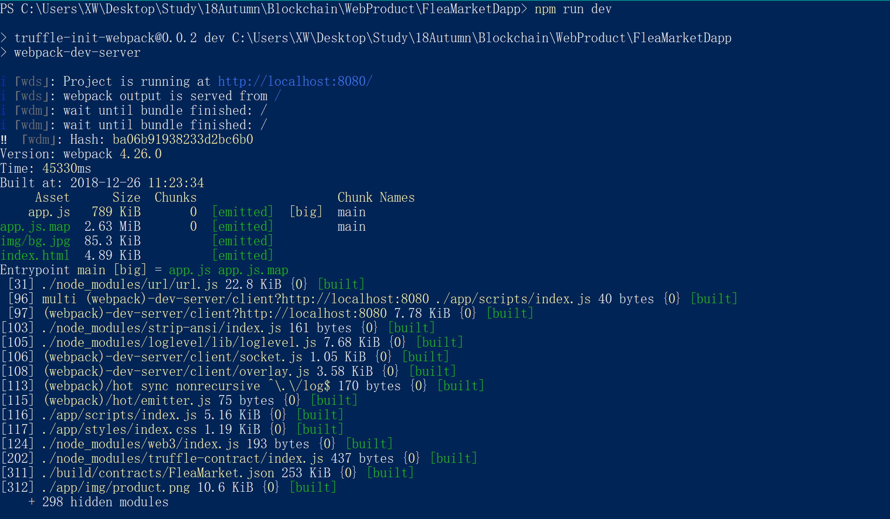

# 二手市场 Flea Market 以太坊DApp 

## 简介

一个可以使用以太币进行交易的二手市场DApp，可以在这里售卖你的物品，或者购买他人的物品。  

## 本项目涉及知识
 - Truffle项目开发
 - 智能合约编写
 - 智能合约部署
 - 使用web3.js和智能合约交互
 - web前端开发
 - 使用MetaMask访问以太坊网络以及管理钱包

## 项目说明
- 项目源代码在 FleaMarketDapp 中。node_modules文件夹由于太大没有上传，要运行 FleaMarketDapp 的话需要有相应的 node_modules。
- 项目报告在 DevelopmentReport 中。

## 简单演示效果

启动服务  

DApp的页面  

在左侧点击`I Want to Sell`可以售卖商品

购买商品  
  

  

  

更多演示效果可查看报告。